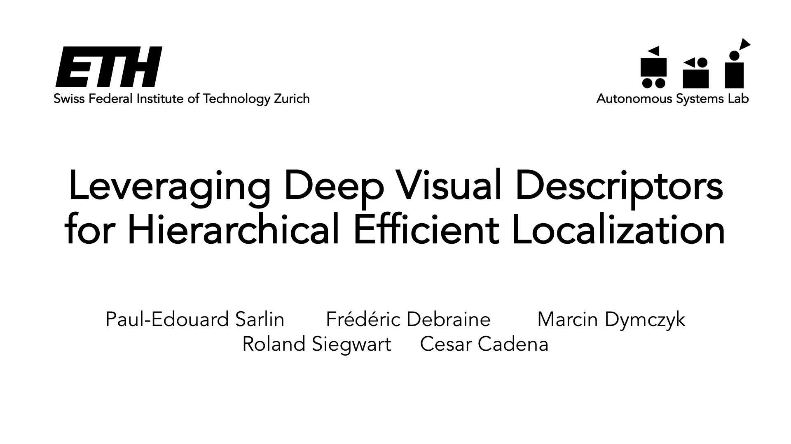
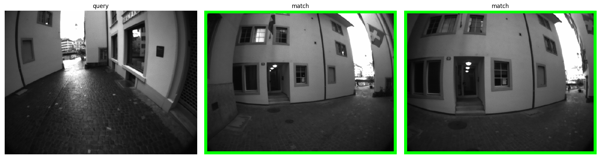
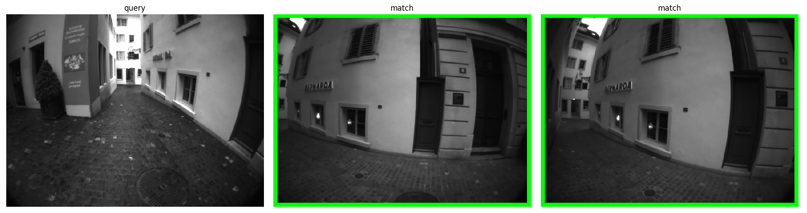

# Hierarchical Localization

:warning: :warning: **For a clean and research-friendly implementation of Hierarchical Localization, please refer to our CVPR 2019 paper at [ethz-asl/hfnet](https://github.com/ethz-asl/hfnet).** :warning: :warning:

This repository contains the training and deployment code used in our paper *[Leveraging Deep Visual Descriptors for Hierarchical Efficient Localization](https://arxiv.org/abs/1809.01019)* presented at [CoRL 2018](http://www.robot-learning.org/). This work introduces **MobileNetVLAD**, a mobile-friendly image retrieval deep neural network that significantly improves the performance of classical 6-DoF visual localization through a hierarchical search.

<p align="center">
    <a href="https://www.youtube.com/watch?v=8cg697oLUtg" target="_blank">
        
        <br /><em>The approach is described in details in our video (click to play).</em>
    </a>
</p>

##

We introduce here two main features:
- The deployment code of MobileNetVLAD: `global-loc`, a C++ ROS/Catkin package that can 
  - load any trained image retrieval model,
  - efficiently perform the inference on GPU or CPU,
  - index a given map and save it as a protobuf,
  - and retrieve keyframes given a query image;
- The training code: `retrievalnet`, a modular Python+Tensorflow package that allows to 
  - train the model on any target image domain,
  - using the supervision of any existing teacher network.

The modularity of our system allows to train a model and index a map on a powerful workstation while performing the retrieval on a mobile platform. Our code has thus been extensively tested on an NVIDIA Jetson TX2, widely used for robotics research.

<p align="center">
    <a href="https://nbviewer.jupyter.org/github/ethz-asl/hierarchical_loc/blob/master/notebooks/tango_visualize_retrieval.ipynb">
        
        
    </a>
    <br /><em>Retrieval on our Zurich dataset: strong illumination and viewpoint changes.</em>
</p>


## Deployment

The package relies on map primitives provided by [maplab](https://github.com/ethz-asl/maplab), but can be easily adapted to other SLAM frameworks. We thus do not release the code performing the local matching. The trained MobileNetVLAD is provided in `global-loc/models/` and is loaded using [tensorflow_catkin](https://github.com/ethz-asl/tensorflow_catkin).

### Installation
Both Ubuntu 14.04 and 16.04 are supported. First install the [system packages](https://github.com/ethz-asl/maplab/wiki/Installation-Ubuntu#install-required-system-packages) required by maplab.

Then setup the Catkin workspace:
```bash
export ROS_VERSION=kinetic #(Ubuntu 16.04: kinetic, Ubuntu 14.04: indigo)
export CATKIN_WS=~/maplab_ws
mkdir -p $CATKIN_WS/src
cd $CATKIN_WS
catkin init
catkin config --merge-devel # Necessary for catkin_tools >= 0.4.
catkin config --extend /opt/ros/$ROS_VERSION
catkin config --cmake-args \
	-DCMAKE_BUILD_TYPE=Release \
	-DENABLE_TIMING=1 \
	-DENABLE_STATISTICS=1 \
	-DCMAKE_CXX_FLAGS="-fext-numeric-literals -msse3 -msse4.1 -msse4.2" \
	-DCMAKE_CXX_STANDARD=14
cd src
```
If you want to perform the inference on GPU (see the requirements of [tensorflow_catkin](https://github.com/ethz-asl/tensorflow_catkin)), add:
```bash
catkin config --append-args --cmake-args -DUSE_GPU=ON
```
Finally clone the repository and build:
```bash
git clone https://github.com/ethz-asl/hierarchical_loc.git --recursive
touch hierarchical_loc/catkin_dependencies/maplab_dependencies/3rd_party/eigen_catkin/CATKIN_IGNORE
touch hierarchical_loc/catkin_dependencies/maplab_dependencies/3rd_party/protobuf_catkin/CATKIN_IGNORE
cd $CATKIN_WS && catkin build global_loc
```
Run the test examples:
```bash
./devel/lib/global_loc/test_inference
./devel/lib/global_loc/test_query_index
```

### Indexing
Given a VI map in `global-loc/maps/`, an index of global descriptors can be created in `global-loc/data/`:
```bash
./devel/lib/global_loc/build_index \
	--map_name <map_name> \
	--model_name mobilenetvlad_depth-0.35 \
	--proto_name <index_name.pb>
```
As an example, we provide the [Zurich map](https://github.com/ethz-asl/hierarchical_loc/releases/download/1.0/lindenhof_afternoon-wet_aligned.tar.gz) used in our paper. Several indexing options are available in [place-retrieval.cc](global-loc/src/place-retrieval.cc), such as subsampling or mission selection.

### Retrieval
An example of query is provided in [test_query_index.cc](global-loc/test/test_query_index.cc). Descriptor indexes for the Zurich dataset are included in `global-loc/data/` and can be used to time the queries:
```bash
./devel/lib/global_loc/time_query \
	--map_name <map_name> \
	--model_name mobilenetvlad_depth-0.35 \
	--proto_name lindenhof_afternoon_aligned_mobilenet-d0.35.pb \
	--query_mission f6837cac0168580aa8a66be7bbb20805 \
	--use_pca --pca_dims 512 --max_num_queries 100
```

Use the same indexes to evaluate and visualize the retrieval: install [retrievalnet](#training), generate the [Python protobuf interface](notebooks/generate_proto_py.sh), and refer to [tango_evaluation.ipynb](https://nbviewer.jupyter.org/github/ethz-asl/hierarchical_loc/blob/master/notebooks/tango_evaluation.ipynb) and [tango_visualize_retrieval.ipynb](https://nbviewer.jupyter.org/github/ethz-asl/hierarchical_loc/blob/master/notebooks/tango_visualize_retrieval.ipynb).

## Training

We use distillation to compress the original NetVLAD model into a smaller MobileNetVLAD with mobile real-time inference capability.
<p align="center">
	
</p>


### Installation

Python 3.5 is required. It is advised to run the following installation commands within a virtual environment. You will be prompted to provide the path to a data folder (subsequently referred as `$DATA_PATH`) containing the datasets and pre-trained models and to an experiment folder (`$EXPER_PATH`) containing the trained models, training logs, and exported descriptors for evaluation.
```
cd retrievalnet && make install
```

### Exporting the target descriptors

If you wish to train MobileNetVLAD on the Google Landmarks dataset as done in our paper, you first need to download [the index of images](https://github.com/ethz-asl/hierarchical_loc/releases/download/1.0/google_landmarks_index.csv) and then download the dataset itself with [download_google_landmarks.py](retrievalnet/downloading/download_google_landmarks.py). The [weights of the original NetVLAD model](http://rpg.ifi.uzh.ch/datasets/netvlad/vd16_pitts30k_conv5_3_vlad_preL2_intra_white.zip) are provided by [netvlad_tf_open](https://github.com/uzh-rpg/netvlad_tf_open) and should be extracted in `$DATA_PATH/weights/`.

Finally export the descriptors of Google Landmarks:
```
python export_descriptors.py config/netvlad_export_distill.yaml google_landmarks/descriptors --as_dataset
```

### Training MobileNetVLAD

Extract the MobileNet encoder [pre-trained on ImageNet](https://storage.googleapis.com/mobilenet_v2/checkpoints/mobilenet_v2_0.35_224.tgz) in `$DATA_PATH/weights/` and run:
```bash
python train.py config/mobilenetvlad_train_distill.yaml mobilenetvlad
```
The training can be interrupted at any time using `Ctrl+C` and can be monitored with Tensorboard summaries saved in `$EXPER_PATH/mobilenetvlad/`. The weights are also saved there.

### Exporting the model for deployment
```bash
python export_model.py config/mobilenetvlad_train_distill.yaml mobilenetvlad
```
will export the model in `$EXPER_PATH/saved_models/mobilenetvlad/`.

### Evaluating on the NCLT dataset

Download the [NCLT sequences](http://robots.engin.umich.edu/nclt/) in `$DATA_PATH/nclt/` along with the corresponding [pose files](https://github.com/ethz-asl/hierarchical_loc/releases/download/1.0/nclt_poses.zip) (generated with [nclt_generate_poses.ipynb](notebooks/nclt_generate_poses.ipynb)). Export the NCLT descriptors, e.g. for MobileNetVLAD:
```bash
python export_descriptors.py configs/mobilenetvlad_export_nclt.yaml mobilenetvlad
```
These can be used to evaluate and visualize the retrieval (see [nclt_evaluation.ipynb](https://nbviewer.jupyter.org/github/ethz-asl/hierarchical_loc/blob/master/notebooks/nclt_evaluation.ipynb) and [nclt_visualize_retrieval.ipynb](https://nbviewer.jupyter.org/github/ethz-asl/hierarchical_loc/blob/master/notebooks/nclt_visualize_retrieval.ipynb)).

## Citation
Please consider citing the corresponding publication if you use this work in an academic context:
```
@inproceedings{hloc2018,
  title={Leveraging Deep Visual Descriptors for Hierarchical Efficient Localization},
  author={Sarlin, P.-E. and Debraine, F. and Dymczyk, M. and Siegwart, R. and Cadena, C.},
  booktitle={Conference on Robot Learning (CoRL)},
  year={2018}
}
```
